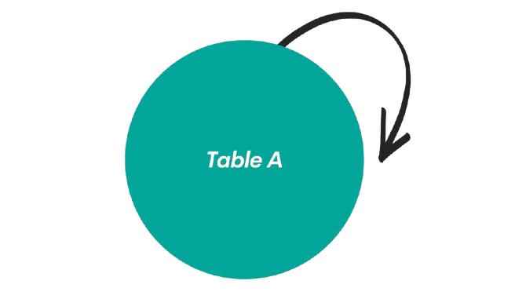
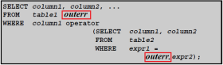

## Introduction to  MYSQL Join Clauses

MySQL supports the `JOIN` syntax for the _`table_references`_ part of [`SELECT`](https://dev.mysql.com/doc/refman/8.4/en/select.html "15.2.13 SELECT Statement") statements and multiple-table [`DELETE`](https://dev.mysql.com/doc/refman/8.4/en/delete.html "15.2.2 DELETE Statement") and [`UPDATE`](https://dev.mysql.com/doc/refman/8.4/en/update.html "15.2.17 UPDATE Statement") statements:

- A **table reference** is also known as a join expression.
- A table reference (when it refers to a partitioned table) may contain a `PARTITION` clause, including a list of comma-separated partitions, subpartitions, or both. This option follows the name of the table and precedes any alias declaration. The effect of this option is that rows are selected only from the listed partitions or subpartitions.

## Join Clause

- A `JOIN` clause is used to combine rows from two or more tables, based on a related column between them. It's essential for retrieving meaningful data from relational databases, where data is spread across multiple tables. The JOIN clause helps in creating a connection between these tables, typically through primary and foreign keys.

## Inner Join Clause

 - `(INNER) JOIN`: Returns records that have matching values in both tables

[](inner-join.png)
##### Use Case

- Best for when you need to find **matching data** between two tables.
- Commonly used when you want to filter records based on the relationship between tables. For example, if you want to find records that have valid, corresponding foreign key relationships.

##### Importance

- The most common and efficient join. It ensures that only rows with a relationship in both tables are returned, making it useful in scenarios where you don’t want to see records without a match.
## Left Join Clause

 - The `LEFT JOIN` keyword returns all records from the left table (table1), and the matching records (if any) from the right table (table2).
 - A `LEFT JOIN` returns all rows from the **left table** (the one before `JOIN`), and the matched rows from the **right table**. If there is no match, NULL values are returned for columns from the right table.

[](left-join.png)
##### Use Case

- Useful when you want to include **all records from the left table**, even when there is no match in the right table.
- Common in scenarios where you need to display data that might not always have associated records in another table, like showing books that may not have an associated author in your database yet.
##### Importance

- Preserves all records from the primary table (left table) even if related data is missing from the secondary table. This ensures that you don’t lose important data from the primary dataset.
## Right Join Clause

- The `RIGHT JOIN` keyword returns all records from the right table (table2), and the matching records (if any) from the left table (table1).
- A `RIGHT JOIN` is the opposite of a `LEFT JOIN`. It returns all rows from the **right table** and the matched rows from the **left table**. If no match is found, NULL values will be returned for columns from the left table.

[](right-join.png)
##### Use Case

- Used when you need to include **all records from the right table** and are not concerned if there are missing values in the left table.
- For example, if you want to see a list of all authors, even those who haven’t published a book.
##### Importance

- Ensures that no data is lost from the secondary (right) table, which is important when the secondary table contains crucial data, such as a list of all available authors, even if they haven't written any books yet.
## Cross Join Clause

- The `CROSS JOIN` keyword returns all records from both tables (table1 and table2).
- The `CROSS JOIN` keyword returns all matching records from both tables whether the other table matches or not. So, if there are rows in "Customers" that do not have matches in "Orders", or if there are rows in "Orders" that do not have matches in "Customers", those rows will be listed as well.
- If you add a `WHERE` clause (if table1 and table2 has a relationship), the `CROSS JOIN` will produce the same result as the `INNER JOIN` clause
	- `CROSS JOIN` can potentially return very large result-sets!
[](full-outer-join.png)
##### Use Case

- Generally used for **testing** or **generating combinations** of data, such as producing all possible pairings of items in two sets.
- Not commonly used in real-world applications due to the large number of combinations it generates.

##### Importance

- Can be useful when you need to see all possible pairings or combinations of data but can quickly become inefficient if large datasets are involved due to the volume of rows generated.

## Self Joins

- A self join is a regular join, but the table is joined with itself.
- Just another copy of a table to itself
- Used to compare rows of the same table
- Helps to display a heirarchy of data

[](self-join.png)
##### Use Case
- Useful for hierarchical or recursive data, like **employee-manager relationships** or **organization trees** where the same entity is related to itself.
##### Importance
- Helps to handle recursive relationships within a single table, allowing for more complex queries, such as traversing hierarchy trees.
## MySQL Subquery
- A subquery is a [`SELECT`](https://dev.mysql.com/doc/refman/8.4/en/select.html "15.2.13 SELECT Statement") statement within another statement.

	The main advantages of subqueries are:
	- They allow queries that are _structured_ so that it is possible to isolate each part of a statement
	- They provide alternative ways to perform operations that would otherwise require complex joins and unions
	- Many people find subqueries more readable than complex joins or unions. Indeed, it was the innovation of subqueries that gave people the original idea of calling the early SQL “Structured Query Language.”

## Subquery in the WHERE Clause

- Uses a subquery within the `WHERE` clause to filter results

```
	SELECT * FROM t1 WHERE column1 = (SELECT column1 FROM t2);
```

	SELECT * FROM t1 ...` is the _outer query_ (or _outer statement_), and `(SELECT column1 FROM t2)` is the _subquery_. We say that the subquery is _nested_ within the outer query, and in fact it is possible to nest subqueries within other subqueries, to a considerable depth. A subquery must always appear within parentheses.

- A subquery in the `WHERE` clause is used to filter the rows returned by the main query based on the result of the subquery. The result of the subquery is used to compare or match rows in the outer query.

#### **Use Case:**

- This is useful when you need to filter data from the main table based on a condition that requires information from another table or set of rows.

#### **Importance:**

- This type of subquery simplifies querying complex data conditions without needing to join multiple tables or write multiple queries manually.
## Subquery with ALL and ANY keywords

- The ALL operator compares value to every value returned by the subquery. Therefore ALL operator (which must follow a comparison operator) returns TRUE if the comparison is TRUE for ALL of the values in the column that the subquery returns.

```
	operand comparison_operator ALL (subquery)
```


- The ANY operator compares the value to each value returned by the subquery. Therefore ANY keyword (which must follow a comparison operator) returns TRUE if the comparison is TRUE for ANY of the values in the column that the subquery returns.

```
	operand comparison_operator ANY (subquery)
```


#### **Explanation:**

- **`ALL`**: Compares a value with **all** the results from the subquery. The outer query returns rows where the condition is true for **every** value returned by the subquery.
- **`ANY`**: Compares a value with **any** of the results from the subquery. The outer query returns rows where the condition is true for **at least one** value from the subquery.
#### **Use Case:**

- **`ALL`**: Used when you want to compare against the highest/lowest value in a list.
- **`ANY`**: Used when you want to match **at least one** of the values in a list, commonly when the comparison doesn’t need to be strict.

#### **Importance:**

These keywords allow fine control over comparisons, enabling developers to query datasets flexibly.
## Correlated Subquery

- A correlated subquery is a subquery that contains a reference to a table (in the parent query) that also appears in the outer query. MySQL evaluates from inside to outside.
- A **correlated subquery** is a subquery that depends on the outer query. The subquery is re-executed for every row in the outer query, as it references a column from the outer query.
- A _correlated subquery_ is a subquery that contains a reference to a table that also appears in the outer query.

	[](mysql-corellated-subquery.png)
#### **Use Case:**

Correlated subqueries are useful when you need to compare each row in the outer query against a dynamically calculated value based on that row.
#### **Importance:**

- Correlated subqueries can be powerful but may impact performance because they are executed repeatedly, once for each row in the outer query. They are essential when querying related data in a dependent fashion.
## Exists and Not Exists

- The EXISTS operator tests for the existence of rows in the results set of the subquery. If a subquery row value is found, EXISTS subquery is TRUE and in this case NOT EXISTS subquery is FALSE.

```
	SELECT column1 FROM table1 WHERE EXISTS (SELECT * FROM table2);
```

- In the above statement, if table2 contains any rows, even rows with NULL values, the EXISTS condition is TRUE. Generally, an EXISTS subquery starts with SELECT *, but it could begin with SELECT 'X', SELECT 5, or SELECT column1 or anything at all. MySQL ignores the SELECT list in such a subquery, so it makes no difference.

- NOT EXISTS subquery almost always contains correlations.
#### **Explanation:**

- **`EXISTS`**: Returns `TRUE` if the subquery returns **at least one row**. It's used to check the existence of rows in another table.
- **`NOT EXISTS`**: Returns `TRUE` if the subquery **does not return any rows**.
#### **Use Case:**

- **`EXISTS`**: Used when you only care about the existence of matching records, not the actual data returned by the subquery.
- **`NOT EXISTS`**: Used when you want to find records in one table that do not have related records in another table.
#### **Importance:**

- These are critical when performing checks for data existence and are more efficient than counting or retrieving data when all you need is to know whether records exist or not.
## Subquery in the SELECT and FROM clause

- Subqueries work in a SELECT statement's FROM clause. 

```
	SELECT ... FROM (subquery) [AS] name ...
```

- Every table in a FROM clause must have a name, therefore the [AS] name clause is mandatory. Any columns in the subquery select list must have unique names.
- A subquery in the `SELECT` clause allows you to include calculated data or lookups from other tables directly in the result set.
- A subquery in the `FROM` clause acts as a **derived table**. It generates a temporary result set that can be joined with other tables in the outer query.
#### **Use Case:**

- **Subquery in `SELECT`**: Used when you need to fetch related data from another table without doing an explicit join.
- **Subquery in `FROM`**: Used when you need to treat the result of a subquery as a table in the outer query, typically for complex aggregations or joins.
#### **Importance:**

These types of subqueries provide powerful ways to break down complex queries by retrieving or calculating data in steps.

## References

- https://dev.mysql.com/doc/refman/8.4/en/join.html
- https://www.w3schools.com/sql/sql_join.asp
- https://www.w3resource.com/mysql/subqueries/index.php#CR


## Materials
 [Powerpoint]

## Take Notes

### **Summary of Differences in Join Queries:**

| **JOIN Type**  | **Explanation**                                                                       | **Use Case**                                                                                              | **Importance**                                                        |
| -------------- | ------------------------------------------------------------------------------------- | --------------------------------------------------------------------------------------------------------- | --------------------------------------------------------------------- |
| **INNER JOIN** | Returns matching rows from both tables.                                               | To get only the matched records from two related tables.                                                  | Efficient for filtering results with existing relationships.          |
| **LEFT JOIN**  | Returns all rows from the left table and matching rows from the right table (if any). | When all records from the left table are required, even without matching data in the right table.         | Preserves data from the main dataset even without full relationships. |
| **RIGHT JOIN** | Returns all rows from the right table and matching rows from the left table (if any). | When you need all records from the right table, even if there is no corresponding data in the left table. | Ensures no loss of data from the secondary dataset (right table).     |
| **CROSS JOIN** | Returns the Cartesian product of both tables (all combinations of rows).              | Generating combinations of items between two tables.                                                      | Creates every possible pairing of rows between two datasets.          |
| **SELF JOIN**  | Joins a table with itself, typically used for comparing rows within the same table.   | Used to model hierarchical data like employee-manager relationships.                                      | Enables recursive querying within the same table.                     |
##### Difference between INNER and CROSS Join

- An **INNER JOIN** returns only the rows that have matching values in both tables based on a specified condition.
	 *Characteristics*
		- **Condition-Based:** Requires a join condition (typically using `ON` or `USING` clauses) to determine how rows from one table relate to rows in another.
		- **Result Set:** Includes only the rows where the join condition is satisfied in both tables.
		- **Usage Scenario:** When you need to retrieve related data that exists in both tables.
		  
	 *Use case*
		 - used when you need to combine rows based on a related column between tables, ensuring that only matching records are returned.
		  
- A **CROSS JOIN** returns the Cartesian product of the two tables involved, meaning it combines each row of the first table with every row of the second table.
	*Characteristics:*
		-  **No Condition-Based:** Does not require a join condition; it simply pairs all rows from both tables.
		- **Result Set:** Includes all possible combinations of rows from the two tables.
		- **Usage Scenario:** When you need to generate all possible combinations, such as creating test data or pairing every item with every other item.
		  
	 *Use Case*
		 - used when you need every possible combination of rows from the involved tables, without considering any relationship between them.

### **Summary of Differences in MySQL Subqueries:**

| **Type**                     | **Explanation**                                           | **Use Case**                                            | **Importance**                                         |
| ---------------------------- | --------------------------------------------------------- | ------------------------------------------------------- | ------------------------------------------------------ |
| **Subquery in WHERE Clause** | Filters rows based on a subquery result                   | Dynamic filtering based on related data                 | Allows complex filtering without joins                 |
| **Subquery with ALL/ANY**    | Compares a value to all or any values from the subquery   | Flexible comparisons between multiple values            | Helps in finding rows with comparisons across sets     |
| **Correlated Subquery**      | Subquery depends on outer query; re-executed for each row | Querying based on per-row conditions                    | Essential for per-row dynamic comparisons              |
| **EXISTS/NOT EXISTS**        | Checks for the presence/absence of rows in the subquery   | Checking for existence of related records               | Efficient for presence checks without fetching data    |
| **Subquery in SELECT/FROM**  | Subquery used for calculated fields or as a derived table | Fetch related data directly or treat a query as a table | Enables complex calculations and table-like subqueries |